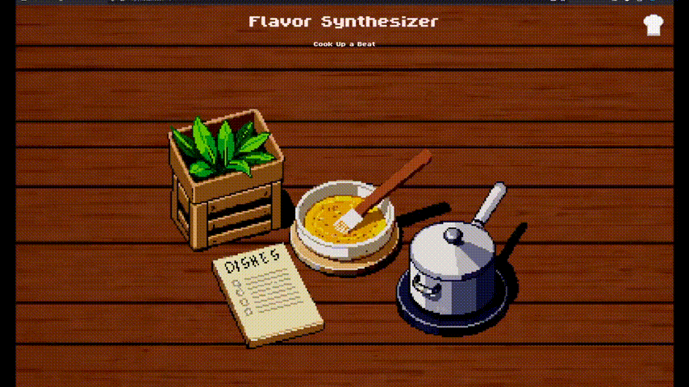
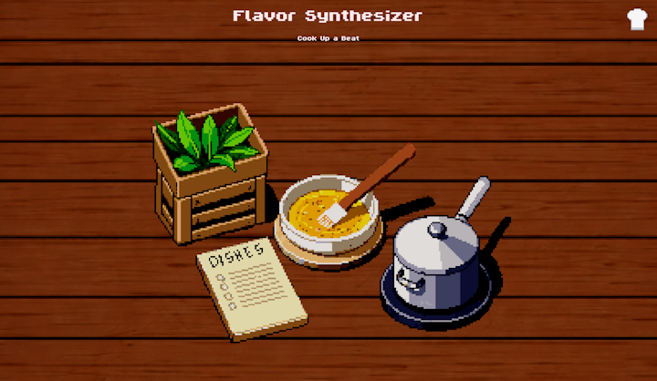
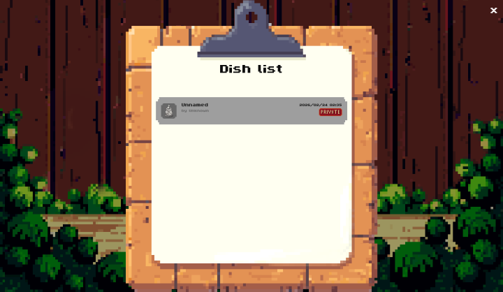
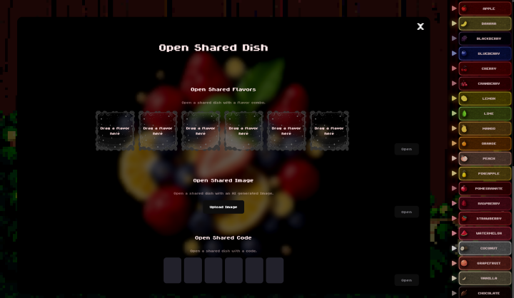
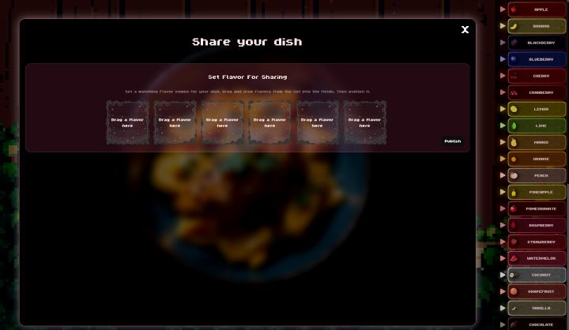
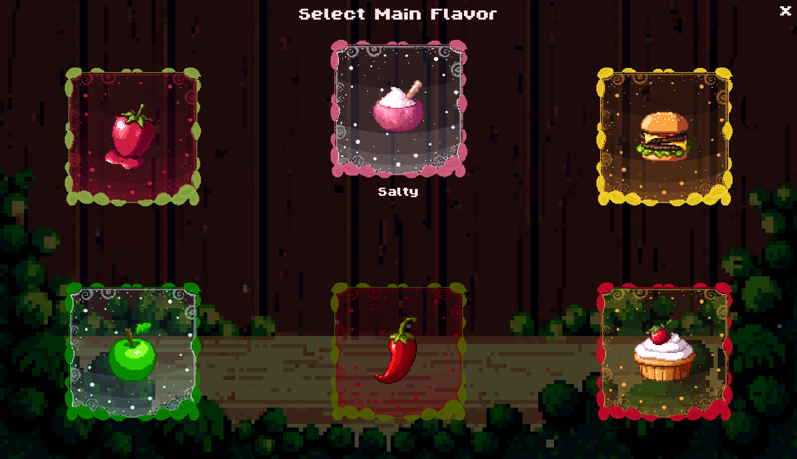
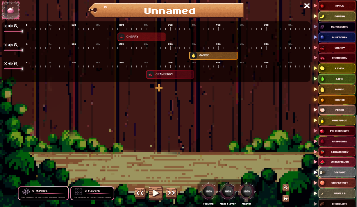
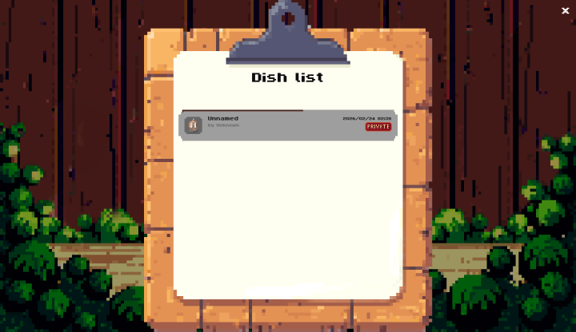

# Flavor Synthesizer




🌐 **Live Demo:** https://flavorsynth.frobeen.com/

## Description
Flavor Synthesizer is a browser-based music sandbox game where players compose playable “dishes” by arranging flavors on a timeline.
Each flavor represents a musical element that can be positioned and resized using drag & drop.
A selected main flavor (Spicy / Sweet / Salty / Savory / Bitter / Sour) defines the harmonic identity of the dish.

Dishes can be:
- Shared via code
- Shared via URL
- Forked by other users
- Exported as an AI-generated image matching the flavor combination


## Features
- Share dishes via code or URL
- Generate AI-based artwork from flavor combinations
- Fork and remix other users' dishes
- Local and server-side dish storage
- User accounts

## Requirements
- Modern browser (Chrome, Edge, Firefox)
- Minimum width: 600px
- Minimum height: 500px
- Audio enabled

## Screenshots
#### Main Menu


Entry point of the application.

#### Dish List


Overview of locally and remotely stored dishes.

#### Open a Shared Dish


Interface for loading shared dishes.

#### Sharing a Dish


Step 1 of the sharing workflow. The second step allows authenticated or anonymous publishing.

#### Creating a Dish / Main Flavor Selector


Main flavor selection screen.

#### Creating a Dish / Editor


Timeline editor interface.

#### Downloading a Dish


Download progress indicator for remote dishes.


## Controls
### Editor
- Drag & drop flavors
- Drag flavor → move horizontally
- Drag edge of flavor → resize
- Shift + Wheel → horizontal scroll
- Ctrl + Wheel → zoom
- Ctrl + Click → multi-select
- Touch gestures supported
- Ctrl + Z / Y → Undo / Redo
- Drag on the timeline → start playback from there
- Long press on Flavor -> Open menu

### Dish List
- Right Click → Menu

## Tech Stack
- React 19 + TypeScript
- Vite (build tool)
- Tone.js (audio engine)
- SCSS
- Python (asset generation & tooling)

## Architecture
Flavor Synthesizer is built around a timeline-based audio engine using [Tone.js](https://github.com/Tonejs/Tone.js).

### Core Data Model
Each Dish is composed of:
```typescript
type Dish = {
  synthLines: SynthLine[]
  masterVolume: number
  flavorVolume: number
  mainFlavorVolume: number
  uuid: string
}
```

```typescript
type SynthLine = {
  flavors: Flavor[]
  volume: number
  isMuted: boolean
  isSolo: boolean
  uuid: string
}
```

```typescript
type Flavor = {
  flavorId: string
  from: number      // start time (seconds or ticks)
  to: number        // end time
  uuid: string
}
```

States are managed using React Contexts.


## Installation
  ### Client
  #### Run
  ```bash
  npm install
  npm run dev
  ```
  #### Build
  ```bash
  npm run build
  ```
  ### Server
  Currently I can't publish the server since it would be a security risk but I plan on publishing it once I rewrote it in node.js and fixed all security risks

## Project Structure
- src/       - Application source code  
  - audio/      - Music logic
  - components/ - React UI components
  - contexts/   - Global state management  
- public/    - Static assets (images, audio, sprites)  


## Planned Features
- [x] Public dish publishing & discovery
- [x] Tutorial System
- [ ] Experience (XP) system
- [ ] Achievement system
- [ ] Real-time collaborative composition

## License
MIT License